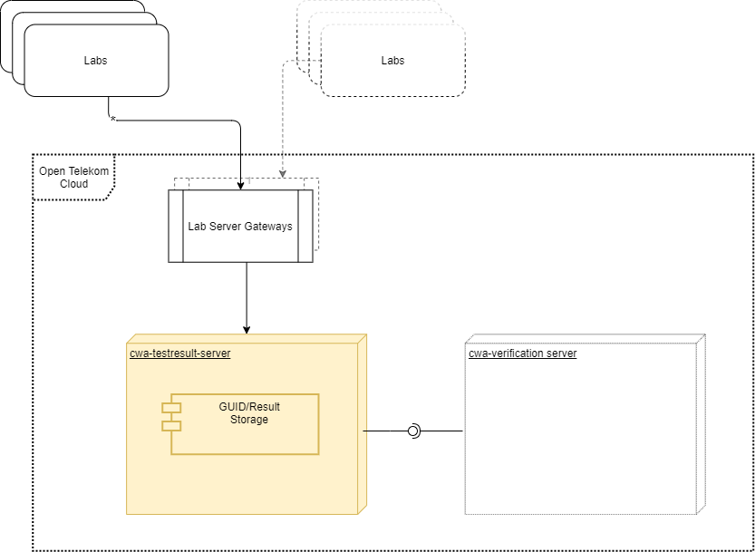

# Software Design Test Result Server

by Andreas Scheibal (andreas.scheibal@t-systems.com)

##	Introduction

This document describes the component Test Result Server for the System “Corona Warn App”. In the world of the Corona Warn App the Test Result Server holds results of medical tests for SARS-CoV-2.

This component was named Lab Server in earlier iterations.

This document links the overall system architecture.
Please keep in mind, that this document is still **work-in-progress**.  

#	Overview

##	Purpose of the Software System Component

The primary scope of the component is to provide the verification server with information of lab test results of SARS-CoV-2 tested people.

##	Context

The Test Result Server provides test results of SARS-CoV-2 tests in a pseudonymized form to only the verification server as it requests such information.

  
Figure 1: Components Test Result Server 

- Lab Server Gateway: System which aggregates the test results from different labs 
- Lab: is the medical facility which executes the test for SARS-CoV-2 and produces the test result 
- Verification Server: The instance which creates proof certificates (TAN) for positive tested users to allow them to upload their diagnostic keys

##	Core Entities

|Entity|	Definition|	
| ------------- |:-------------:|
|GUID|	Identifier for a SARS-CoV-2 Test. This component will deal only with hashed instances of the GUID. For the details of the hashing see used cryptographic algorithms. The GUID has a length of 152 bits, it consists of a prefix of 24 bits and a main part of 128 bits. Only the main part is generated by a cryptographically reliable process.	|
|test result|	The actual result of the test represented by a number between 1 and 4. 1=negative, 2=positive, 3=test invalid, 4=test redeemed 	|

# Software Design

##	Privacy Constraints
The Test Result Server handles pseudonymised health data, this data needs a high level of protection. This is the reason why this component, although it does simple [CRUD](https://en.wikipedia.org/wiki/Create,_read,_update_and_delete) operations is put in a separate component.  
The data is protected by several measures. 

### Measures
|ID|	Measure	|Comment|
| ------------- |:-------------:| -----:|
|M1|	Not persisting IP addresses anywhere in the Verification Server 	|
|M2|	Early deletion of data 	|For all entities a deletion strategy is defined|
|M3|	Make sure that application logfiles do not contain any data that is personal relatable, no hashed GUID, no GUID, no test results, no Registration Tokens	|
|M4|	Persist only hashed values for pseudonymised data	|

##	Measures to increase data privacy
###	Separate Operation of Test Result Server and Verification Server
The Test Result Server and Verification Server are operated by different operating teams and run in different namespaces in one cloud tenant. The namespaces organize access rights to different group of people, such as operation teams.

###	Logging

Primary key or pseudonymous data must not be part of a logging statement, the only exception is detected abuse cases.
All Logging level is kept to INFO except in case of abusement.
Logfiles are kept for 30 days.

##	Actors
- **User/Patient**: Person, who is tested for SARS-CoV-2, is equipped with a smartphone, Corona Warn App installed 
- **Test Center**: Facility where the user can donate a probe to be tested for SARS-CoV-2, such as hospitals or practicing doctors 
- **Lab**: Facility which tests the probe of the user and produces a trusted test result on SARS-CoV-2. 
- **Verification Server**: Software service which proves that a user, who is taking part in the Corona Warn App and who is willing to file his Diagnosis Keys, has been really tested positive by an established authority 
- **Test Result Server**: Software service, that imports the test results provided by the Labs and stores them for further use. 

##	Supported User Stories 
The implementation of user stories around verification involves several components, this chapter documents the mapping between Verification User Stories and Verification Server Use Cases. The user stories are detailed in [Scoping].
###	User Story E05.01 – Avoid false positive reports
Implemented by
* Use Case create result
* Use Case retrieve result

##	Implemented Use Cases

###	Use Case create test result
API Endpoint:
-	Method: POST /api/v1/lab/results
-	Body:  [{"id": "hashedGUID,
             "result": [1-3]},
            {...}
           ] 
-	Authentication: none
1 = negative,
2 = positive,
3 = test result invalid  
The endpoint can receive several test results in one call.

Steps:
1.	lab provides 1..n test results
2.	test result server inserts test results into its DB

###	Use Case retrieve test result
It is important to note, that only one Registration Token will be generated for a specific GUID or teleTAN. The use case generates Registration Tokens from hashed GUIDs xor teleTANs. This is a measure to increase data privacy.

API Endpoint:
-	Method: POST /api/v1/app/result
Body: { 
"id": "hashedGUID"
}
-	Authentication: none  

Steps:  
1.	The client, the verification server, retrieves the result by providing a hashedGUID, which was scanned by a user, routed through the verification server to the test result server.

###	Use Case Delete data to keep data privacy high

Steps: 
1.	Delete all entities hashedGUID, result older than the defined max age

##	API
The API is REST based and the description below, is detailed by the implementation. The API endpoint provides a swagger definition. The API does support versioning as part of the URI.

##	Technology Stack
* Spring Boot
* PostgreSQL

#	Data Model

The data model is persisted in a dedicated schema.

##	Entity test results

The entity TAN represents the authorization (sometimes referred as “proof”) that a user was SARS-CoV-2 positive tested.

|Name|	Not null|	Type|	Definition|
| ------------- |:-------------:| -----:| -----:|
|id|	Y|	GUID| row key|
|result_id|	Y|	string[64]|	sha256 hash of the GUID of the test|
|result_date|	Y|	Date|	Date the result was received, used for purging the result after a given amount of time |
|result| N|	int | the integer value representing the result (enumeration of PENDING, NEGATIVE, POSITIVE, INVALID, REDEEMED)|

###	Data Deletion
After 21 days the result attribute is set to the "redeemed" state which masks the former state. 
Data is deleted after 90 days.

# Security

##	Authentication

###	Authentication of other systems

|Role|	Authentication	|Comment|
| ------------- |:-------------:| -----:|
|GW to connected Labs (/lab/result Endpoint) | TLS Client Certificate, 2nd factor IP Range | Endpoint is exposed to an other security zone
|cwa-verification-server| TLS Client Certificate|

## Threat Model
**_This chapter is still in work._**

###	Threats
###	Measures
			
			

##	Used cryptographic algorithms
- Hashing of GUID: SHA-256, no salt, no pepper

##	Complexity of secrets
- hashed GUID: 128 bits

## Used Timeframes
